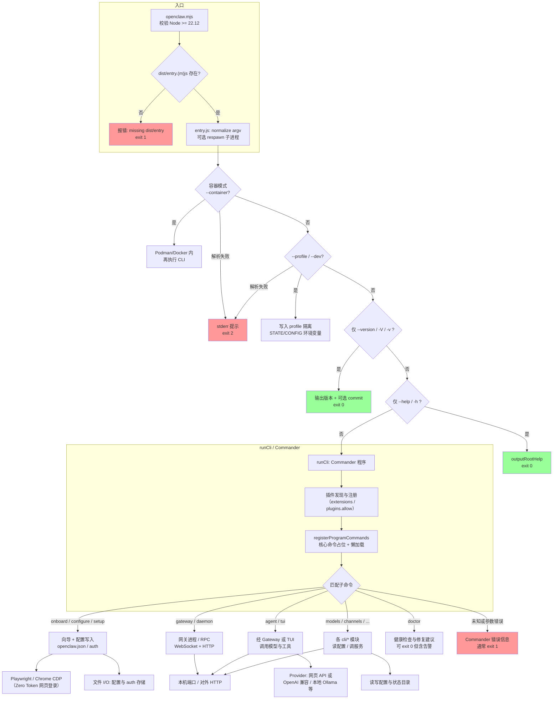

# OpenClaw / openclaw-zero-token CLI 架构流程

本文档描述本仓库中 **命令行入口** 到 **子命令执行** 的主路径，便于对照源码（`openclaw.mjs`、`entry.ts`、`cli/`）。与上游 OpenClaw 大架构说明见根目录 `ARCHITECTURE.md`。

## 图表说明

- **实线**：主流程；**虚线**：按需加载（懒注册子命令）或异步分支。
- **退出码**：`0` 成功；`1` 一般错误（校验失败、运行失败）；`2` 根级参数解析错误（如 `--container` / `--profile` 组合非法）；Node 版本过低时 `openclaw.mjs` 直接 `exit(1)`。
- **Zero Token**：`onboard` / `configure` 等流程可触发 `src/zero-token/providers/*` 与 Playwright/CDP，向各厂商 **网页 API** 发起请求；凭证落盘于状态目录下的 `auth.json` 等（勿提交版本库）。

## 与源码的对应关系

| 阶段                      | 主要文件                                                               |
| ------------------------- | ---------------------------------------------------------------------- |
| 引导包装                  | `openclaw.mjs`                                                         |
| 进程入口、版本/帮助快路径 | `entry.ts`                                                             |
| CLI 主循环                | `cli/run-main.ts` → `cli/program/*`                                    |
| 核心子命令注册            | `cli/program/command-registry.ts`                                      |
| 扩展子命令                | `cli/program/register.subclis.ts`、`cli/program/subcli-descriptors.ts` |
| Zero Token 网页侧         | `src/zero-token/providers/`、`src/zero-token/streams/`                 |
